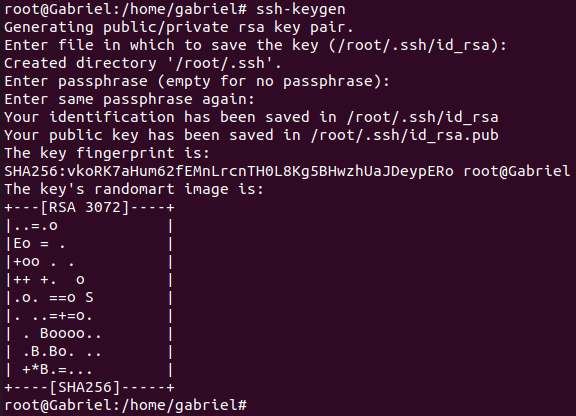
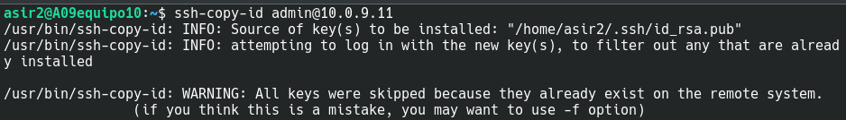
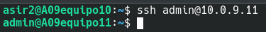
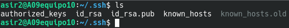
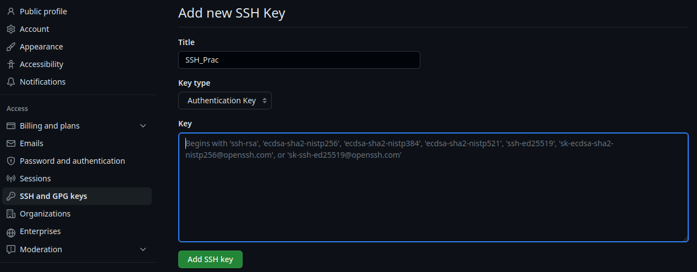
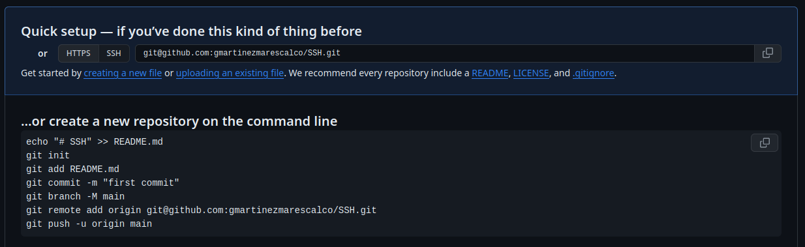
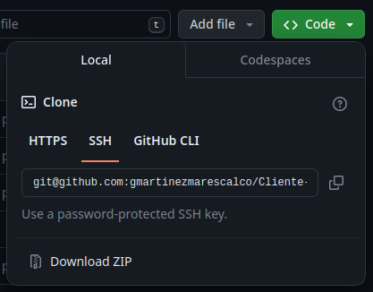

# SSH

## Creación de clave SSH

**Para crear una clave SSH público/privada en primera instancia hay que utilizar el siguiente comando:**

    ssh keygen

**Una vez creadas las claves, nos muestra en dónde se encuentra cada una.**

## Conectarse a otro equipo

**Para que un equipo se pueda conectar a otro mediante el uso de claves público/privadas en primer lugar este debe de estar en posesión de dicha clave. Para esto el cliente debe enviar al servidor su clave mediante el uso del siguiente comando**

    ssh-copy-id "nombre_usuario"@"ip_equipo_remoto"

**Ya hecho esto lo único que debe hacer el equipo remoto es lanzar el siguiente comando**

    ssh "nombre_usuario"@"ip_equipo_remoto"

## Configurar GitHUB mediante SSH

**En el apartado de claves SSH de GitHUB debemos crear una nueva, asignarle un nombre y en el bloque de texto de abajo se ha de colocar nuestra clave ***PÚBLICA*****

**La clave púlica se encuentra en ***id_rsa.pub*****

**Ya una vez hecho esto podemos crear y clonar repositorios mediante el uso de ssh**

